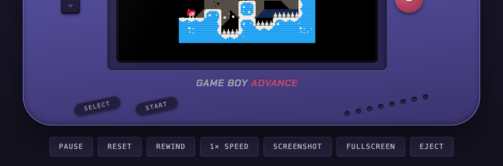
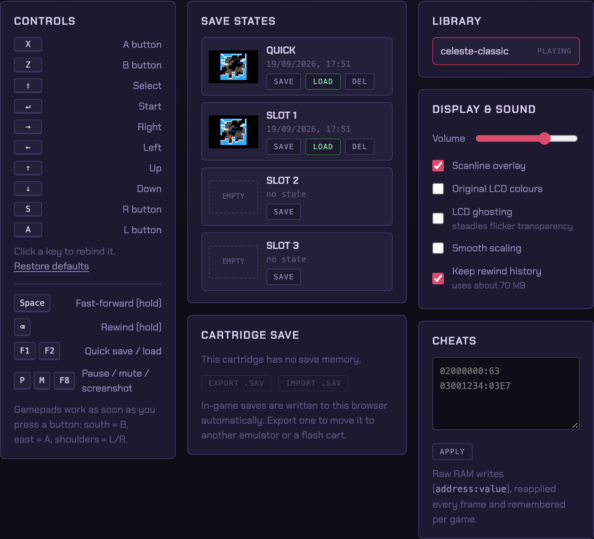

# AGB-EMU

A Game Boy Advance emulator written from scratch in TypeScript. It runs
entirely in the browser and uses no emulator libraries: the ARM7TDMI core,
PPU, APU, DMA, timers, save hardware, real-time clock and HLE BIOS all live
in this repo.



## Run it

```bash
npm install
npm run dev        # http://localhost:5173
```

Drop a `.gba` or `.zip` onto the cartridge slot, or click it to browse.
ROMs, battery saves, save states, settings and an optional BIOS are kept in
IndexedDB and localStorage. Nothing leaves your browser.

```bash
npm run build      # type-check + production bundle in dist/
npm test           # headless regression suite
```

## What it does



**Playing**

- Rewind: hold `Backspace` (or the REWIND button) to run the last ~18
  seconds backwards
- Four save-state slots per game with thumbnails, plus quick save/load
- Fast-forward at 2×, 4× or 8×, or hold `Space`
- Keyboard controls you can rebind by clicking them; gamepads work through
  the Gamepad API; the on-screen buttons take touch and mouse
- 4× PNG screenshots

**Saves**

- SRAM, Flash 64K/128K and EEPROM 512B/8K, detected from the ROM. EEPROM
  size is worked out from how the game talks to it
- In-game saves are written back to the browser as they change
- Export a `.sav` to use elsewhere, or drop one on the page to import it
- Real-time clock on the cartridge GPIO port, so Pokémon Ruby, Sapphire
  and Emerald keep time

**Picture and sound**

- Scanline overlay, original-LCD colour correction, LCD ghosting (steadies
  games that flicker sprites to fake transparency), optional smooth scaling
- 48 kHz stereo through an AudioWorklet. The output rate follows the sound
  card's clock so audio doesn't drift or crackle
- Volume and mute

**Extras**

- Raw `address:value` cheats, remembered per game
- Optional real `gba_bios.bin`. Without one, a small synthesized BIOS
  handles interrupts and the SWIs are emulated at a high level

## Controls

| Input             | Action               |
| ----------------- | -------------------- |
| Arrow keys        | D-Pad                |
| `X` / `Z`         | A / B                |
| `A` / `S`         | L / R                |
| `Enter` / `Shift` | Start / Select       |
| `Space` (hold)    | Fast-forward         |
| `Backspace` (hold)| Rewind               |
| `F1` / `F2`       | Quick save / load    |
| `P` / `M` / `F8`  | Pause / mute / screenshot |

The first ten are defaults; rebind them in the Controls panel. On a
standard-layout gamepad: south = B, east = A, shoulders = L/R, d-pad or left
stick to move.

## Emulation

- **CPU**: ARM7TDMI interpreter, ARM and Thumb, banked registers, IRQ / SWI
  / undefined exceptions, correct `r15` pipeline behaviour, rotated
  misaligned loads, the odd register-list edge cases
- **Bus**: waitstates driven by `WAITCNT`, game pak prefetch approximation,
  open bus and BIOS read protection, out-of-range ROM reads, byte writes to
  IO registers widened the way hardware does it
- **PPU**: modes 0-5, text and affine backgrounds, sprites (regular, affine,
  double-size), both windows plus the OBJ window, alpha blending and
  brightness fades, BG and OBJ mosaic
- **APU**: two square channels (with sweep), wave channel with both RAM
  banks, noise, a 512 Hz frame sequencer, and the two DMA-fed direct sound
  FIFOs
- **System**: all four DMA channels and timing modes, cascading timers,
  interrupt controller, keypad interrupts, HALT
- **Timing**: the CPU runs in batches up to the next PPU or timer event and
  the other hardware catches up on demand, which keeps it cycle-counted
  without paying for it on every instruction. A desktop browser has
  several times the headroom needed for full speed

## Project layout

```
src/emu/      emulator core (no DOM dependencies)
  cpu.ts      ARM7TDMI: ARM/Thumb interpreters, flags, exceptions
  bus.ts      memory map, waitstates, open bus, IO dispatch
  ppu.ts      renderer: modes 0-5, sprites, windows, blending, mosaic
  apu.ts      sound: PSG channels, wave RAM, FIFOs, mixer
  system.ts   timers, DMA, interrupts, keypad, serial stub
  saves.ts    SRAM / Flash / EEPROM
  gpio.ts     cartridge GPIO + real-time clock
  bios.ts     HLE SWIs + synthesized BIOS image
  state.ts    save-state serialization
  gba.ts      machine wiring, frame loop, save states
src/ui/       browser glue: audio worklet, input, library (IndexedDB),
              settings, rewind, zip, cheats, pixel font
src/main.ts   app orchestration
tools/        headless rigs: test suite, tracer, input driver, e2e,
              README screenshots
testroms/     test ROMs (see below)
```

## Testing

`npm test` runs jsmolka's [gba-tests](https://github.com/jsmolka/gba-tests)
(ARM, Thumb, memory, BIOS, save hardware and edge-case suites, MIT licensed
and included under `testroms/jsmolka`) and checks that a save state resumes
bit-for-bit. Everything passes. ARMWRESTLER's ARM and Thumb suites pass too.

```bash
npx tsx tools/run-test.mts testroms/armwrestler-fixed.gba 600 frame.png
npx tsx tools/drive.mts <rom> "300:0,10:8,600:0" out.png   # scripted input
npx tsx tools/e2e.mts            # drives the real UI in Chrome (needs dev server)
npx tsx tools/screenshots.mts    # regenerates docs/screenshots
```

## Notes

Only load ROMs of games you own. Not emulated: link cable and multiplayer,
solar / tilt / rumble cartridges, encrypted GameShark and Action Replay
codes. Timing is cycle-counted rather than cycle-exact, so the rare game
that depends on mid-scanline effects or exact prefetch behaviour may
misbehave.
